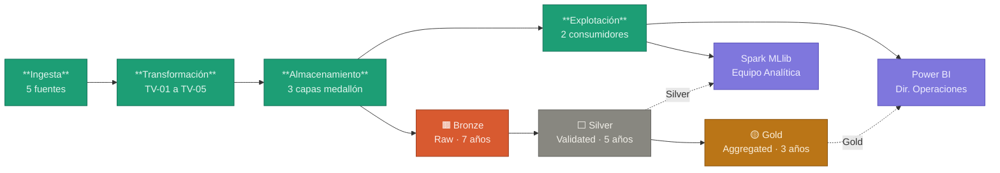

# Pipeline de Datos - Ciclo de Vida

**Identificador:** ET-CV-001 | **Versión:** 1.0 | **Fecha:** 2026-05-01
**Marco de referencia:** UNE 0087
**Proceso asociado:** ET-PN-001 - Previsión de la Demanda Energética

Las políticas de gobierno por etapa se detallan en [politicas.md](politicas.md).

---

## Arquitectura general

---

## Etapa 1 - Ingesta

El dato entra al pipeline desde cinco sistemas fuente con mecanismos de extracción diferenciados:

| Dataset | Sistema | Mecanismo | Frecuencia |
|:---|:---|:---|:---|
| DS-CLIENTES-CRM | CRM Salesforce | Batch (API REST) | Semanal |
| DS-CONSUMO-HIST | SCADA / SAP-ISU | Streaming (Kafka) | Tiempo real - granularidad horaria |
| DS-METEO-AEMET | AEMET API | Pull (API REST) | Diaria - retraso máximo 24 h |
| DS-CALENDARIO | BOE / API | Batch | Anual |
| DS-TARIFAS-OMIE | OMIE / REE API | Pull (API REST) | Diaria |

El hito crítico de esta etapa es la seudonimización: el `id_cliente` se sustituye por `id_cliente_token` (SHA-256) en el perímetro del CRM, antes de que el dato entre al Data Lake. El identificador real nunca sale del sistema origen (POL-CV-01).

---

## Etapa 2 - Transformación

Refinamiento y control de calidad sobre los datos ingestados. Los controles se ejecutan en secuencia y son bloqueantes si superan los umbrales críticos.

| Código | Control | Umbral | Acción si falla |
|:---|:---|:---|:---|
| TV-01 | Completitud | Nulidad en campos obligatorios < 5% | Rechazo del lote; log de auditoría obligatorio |
| TV-02 | Rango / Exactitud | Consumos negativos o > 3× media histórica | Marcado como `ESTIMADA`; alerta al Data Steward |
| TV-03 | Coherencia temporal | Gaps en series temporales ≤ 48 h | Interpolación lineal; gaps > 48 h --> revisión manual |
| TV-04 | Unicidad | 0 duplicados por `(id_cliente_token, ts_lectura, cups)` | Deduplicación; log del registro descartado |
| TV-05 | Actualidad meteorológica | Retraso datos AEMET < 24 h | Bloqueo del modelo hasta recibir datos actualizados |

Todo dato rechazado queda registrado con motivo de rechazo (POL-CV-03).

---

## Etapa 3 - Almacenamiento

Arquitectura medallón sobre Data Lake / Data Warehouse:

| Capa | Nombre | Contenido | Retención | Acceso |
|:---|:---|:---|:---|:---|
| Bronze | Raw | Datos crudos tal como llegan de origen | 7 años (normativa) | DBA únicamente |
| Silver | Validated | Datos limpios, normalizados y con calidad verificada | 5 años | Analistas y DBA |
| Gold | Aggregated | Features para IA; agregaciones para BI | 3 años | Analistas, BI, Dirección |

Los entornos con datos identificables (Bronze) y los entornos analíticos (Silver/Gold, seudonimizados) están físicamente separados con controles de acceso independientes (POL-CV-04).

---

## Etapa 4 - Explotación

| Canal | Herramienta | Usuarios | Datos consumidos |
|:---|:---|:---|:---|
| Analítica avanzada | Spark MLlib / MLflow | Equipo de Analítica | `fact_consumo_horario` (Silver), features Gold |
| Business Intelligence | Power BI | Dirección de Operaciones | `fact_prevision_demanda` (Gold), agregaciones |

El acceso a cada capa está controlado por RBAC (G10-016). Los perfiles de BI no acceden a la capa Bronze bajo ningún concepto (POL-CV-06).