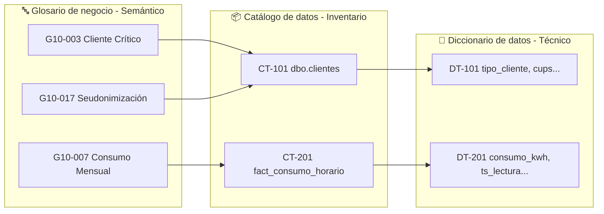

# MetDat - Matriz de Trazabilidad

**Identificador:** ET-TRAZ-001
**Versión:** 1.0 | **Fecha:** 2026-05-01
**Marco de referencia:** UNE 0087

> Esta matriz cruza los tres niveles del repositorio de metadatos: glosario (semántico) → catálogo (inventario) → diccionario (implementación física).
> Permite navegar desde un concepto de negocio hasta su campo concreto en base de datos, y al revés.

---

## Matriz glosario ↔ catálogo ↔ diccionario

| Concepto de negocio | ID Glosario | ID Catálogo | Sistema fuente | Tabla / Endpoint | Campos clave | Dataset P1 |
|:---|:---|:---|:---|:---|:---|:---|
| Segmentación de cliente | G10-003, G10-004, G10-005 | CT-101 | CRM Salesforce | `dbo.clientes` | `tipo_cliente`, `cups` | DS-CLIENTES-CRM |
| Identidad protegida (RGPD) | G10-017 | CT-101 | CRM Salesforce | `dbo.clientes` | `id_cliente_token` | DS-CLIENTES-CRM |
| Potencia y SLA | G10-013, G10-018 | CT-101 | CRM Salesforce | `dbo.clientes` | `potencia_contratada`, `sla_reforzado` | DS-CLIENTES-CRM |
| Punto de suministro | G10-015 | CT-101 | CRM Salesforce | `dbo.clientes` | `cups`, `zona_geografica` | DS-CLIENTES-CRM |
| Medición energética horaria | G10-006, G10-007, G10-002 | CT-201 | SCADA / SAP-ISU | `fact_consumo_horario` | `consumo_kwh`, `calidad_lectura`, `ts_lectura` | DS-CONSUMO-HIST |
| Variables meteorológicas | G10-008 | CT-301 | API AEMET | `aemet_observaciones` | `temperatura_c`, `humedad_pct`, `radiacion_wm2` | DS-METEO-AEMET |
| Festivos y calendario | G10-001 | CT-401 | BOE / API | `dim_festivos_nacionales` | `fecha`, `ambito`, `zona_geografica` | DS-CALENDARIO |
| Tarifas energéticas | G10-019 | CT-501 | OMIE / REE API | Endpoint REST OMIE | `precio_mwh`, `hora`, `fecha` | DS-TARIFAS-OMIE |
| Modelo predictivo y MAPE | G10-011, G10-012 | CT-601 | MLflow | `model_versions` | `version`, `mape_validation`, `hyperparameters` | - |
| Previsión de demanda | G10-014, G10-010 | CT-701 | Motor IA | `fact_prevision_demanda` | `demanda_kwh`, `mape_modelo`, `mes_prevision` | - |
| Zona geográfica | G10-020 | CT-101, CT-301, CT-401, CT-701 | Múltiples | Múltiples tablas | `zona_geografica` | - |

---

## Trazabilidad con el proceso de negocio (ET-PN-001)

| Actividad BPMN | Datasets consumidos | Datasets producidos | Conceptos glosario implicados |
|:---|:---|:---|:---|
| Act. 1 - Ingesta | DS-CLIENTES-CRM, DS-CONSUMO-HIST, DS-METEO-AEMET, DS-CALENDARIO, DS-TARIFAS-OMIE | Dataset bruto de entrada | G10-005, G10-006, G10-008, G10-001, G10-019 |
| Act. 1 (post-ingesta) | DS-CLIENTES-CRM | DS-CLIENTES-CRM seudonimizado | G10-017 |
| Act. 2 - Validación | Dataset bruto | Dataset validado + Informe de calidad | G10-002, G10-007, G10-015 |
| Act. 3 - Modelo | Dataset validado, CT-601 | `fact_prevision_demanda`, ET-LOG-EXEC | G10-009, G10-011, G10-012 |
| Act. 4 - Informe | `fact_prevision_demanda` | ET-INF-PREV-YYYYMM | G10-010, G10-014 |
| Act. 5 - Entrega | ET-INF-PREV-YYYYMM | - | G10-016, G10-018 |

---

## Términos sin trazabilidad física completa

| ID Glosario | Término | Situación |
|:---|:---|:---|
| G10-009 | ETL | Proceso transversal - no tiene tabla física propia; aplica a todas las actividades de transformación |
| G10-016 | RBAC | Mecanismo de control - implementado a nivel de plataforma, no en una tabla de datos |
| G10-020 | Zona Geográfica | Campo presente en múltiples tablas - no tiene tabla maestra propia (pendiente confirmar si existe `dim_zonas`) |
