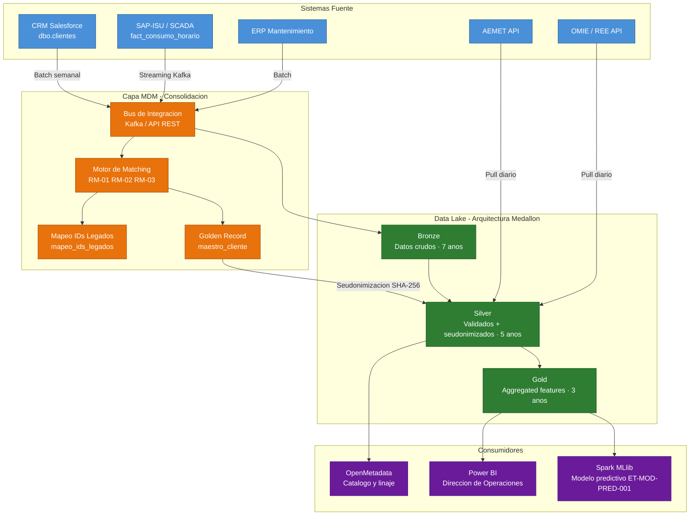

# ArqDat - Arquitectura de Datos

**Identificador:** ET-ARQ-001 | **Version:** 1.0 | **Fecha:** 2026-05-01
**Marco de referencia:** UNE 0078 - ArqDat
**Proceso asociado:** ET-PN-001 - Prevision de la Demanda Energetica

---

## 1. Modelo conceptual de datos

El modelo conceptual define las entidades de negocio y sus relaciones, independientemente de la implementacion fisica. Se exporta como diagrama UML/ER desde Visual Paradigm.

### Entidades y relaciones

| Entidad | Descripcion | Ref. Glosario P2 |
| :--- | :--- | :--- |
| **Cliente** | Sujeto titular de uno o mas contratos de suministro. Entidad maestra gestionada por MDM | G10-003, G10-004, G10-005 |
| **PuntoSuministro** | Ubicacion fisica de entrega de energia identificada por CUPS | G10-015 |
| **ZonaGeografica** | Agrupacion territorial de puntos de suministro con caracteristicas climaticas similares | G10-020 |
| **ConsumoHorario** | Lectura de energia consumida en una hora concreta en un punto de suministro | G10-006, G10-007 |
| **PrevisionDemanda** | Estimacion de consumo futuro generada por el modelo predictivo | G10-014 |
| **VersionModelo** | Version concreta del modelo IA/ML usada para generar previsiones | G10-012 |

**Relaciones:**

- Cliente **1..N** PuntoSuministro (un cliente puede tener varios CUPS)
- ZonaGeografica **1..N** PuntoSuministro (una zona agrupa varios puntos)
- PuntoSuministro **1..N** ConsumoHorario (un punto tiene multiples lecturas horarias)
- Cliente **1..N** PrevisionDemanda (se genera una prevision por cliente y mes)
- ZonaGeografica **1..N** PrevisionDemanda (dimension de agrupacion de previsiones)
- VersionModelo **1..N** PrevisionDemanda (trazabilidad del modelo usado)

---

## 2. Modelo logico relacional

Derivado del modelo conceptual. Muestra las tablas, claves primarias, claves foraneas y tipos logicos antes de la implementacion fisica en MySQL.

### dim_zona_geografica
| Columna | Tipo logico | Clave | Descripcion |
| :--- | :--- | :--- | :--- |
| `codigo_zona` | VARCHAR(10) | PK | Formato ZN-[A-Z]{3}-[0-9]{3} |
| `nombre` | VARCHAR(100) | - | Nombre descriptivo de la zona |
| `estacion_aemet_ref` | VARCHAR(10) | - | Codigo de estacion AEMET de referencia para la zona |

### maestro_cliente (MDM Golden Record)
| Columna | Tipo logico | Clave | Descripcion |
| :--- | :--- | :--- | :--- |
| `id_cliente_maestro` | CHAR(36) | PK | UUID generado por MDM; inmutable |
| `id_nacional` | VARCHAR(20) | UNIQUE | DNI o NIE; clave de matching RM-01 |
| `id_cliente_token` | VARCHAR(64) | UNIQUE | SHA256(id_cliente_maestro + salt) |
| `nombre_normalizado` | VARCHAR(100) | - | Nombre canonico tras limpieza MDM |
| `tipo_cliente` | VARCHAR(20) | - | FK -> ref_tipo_cliente |
| `sla_reforzado` | BOOLEAN | - | TRUE si tipo_cliente = CRIT |
| `estado` | VARCHAR(20) | - | FK -> ref_estado_cliente |
| `email_verificado` | VARCHAR(150) | - | Email normalizado; usado en RM-02 |
| `fecha_alta_maestra` | DATE | - | Fecha de creacion del golden record |

### mapeo_ids_legados
| Columna | Tipo logico | Clave | Descripcion |
| :--- | :--- | :--- | :--- |
| `id_mapeo` | BIGINT | PK | Autoincremental |
| `id_cliente_maestro` | CHAR(36) | FK -> maestro_cliente | Golden record al que apunta |
| `sistema_origen` | VARCHAR(30) | - | CRM, SAP-ISU o ERP |
| `id_legado` | VARCHAR(30) | - | ID original en el sistema fuente |
| `estado_matching` | VARCHAR(20) | - | FK -> ref_estado_matching |
| `ts_creacion` | TIMESTAMP | - | Fecha de la fusion |

### dim_punto_suministro
| Columna | Tipo logico | Clave | Descripcion |
| :--- | :--- | :--- | :--- |
| `cups` | VARCHAR(22) | PK | Formato ES[0-9]{16}[A-Z]{2} |
| `id_cliente_token` | VARCHAR(64) | FK -> maestro_cliente | Cliente titular (seudonimizado) |
| `codigo_zona` | VARCHAR(10) | FK -> dim_zona_geografica | Zona de distribucion |
| `potencia_contratada` | DECIMAL(6,2) | - | En kW; > 0 |
| `fecha_alta` | DATE | - | Alta del punto de suministro |
| `estado` | VARCHAR(20) | - | FK -> ref_estado_cups |

### fact_consumo_horario
| Columna | Tipo logico | Clave | Descripcion |
| :--- | :--- | :--- | :--- |
| `id_registro` | BIGINT | PK | Autoincremental |
| `id_cliente_token` | VARCHAR(64) | FK -> maestro_cliente | Cliente seudonimizado |
| `cups` | VARCHAR(22) | FK -> dim_punto_suministro | Punto de suministro |
| `ts_lectura` | TIMESTAMP | - | UTC; granularidad horaria |
| `consumo_kwh` | DECIMAL(10,4) | - | >= 0 |
| `calidad_lectura` | VARCHAR(10) | - | FK -> ref_calidad_lectura |

### fact_prevision_demanda
| Columna | Tipo logico | Clave | Descripcion |
| :--- | :--- | :--- | :--- |
| `id_prevision` | BIGINT | PK | Autoincremental |
| `id_cliente_token` | VARCHAR(64) | FK -> maestro_cliente | Cliente seudonimizado |
| `codigo_zona` | VARCHAR(10) | FK -> dim_zona_geografica | Zona de la prevision |
| `version_modelo` | VARCHAR(50) | FK -> version_modelo | Modelo usado |
| `mes_prevision` | DATE | - | Primer dia del mes previsto |
| `demanda_kwh` | DECIMAL(12,4) | - | Energia prevista en kWh |
| `mape_modelo` | DECIMAL(5,2) | - | <= 10 para ser valida |

### version_modelo
| Columna | Tipo logico | Clave | Descripcion |
| :--- | :--- | :--- | :--- |
| `version` | VARCHAR(50) | PK | Ej: ET-MOD-PRED-001-v1.2 |
| `fecha_entrenamiento` | TIMESTAMP | - | Fecha de entrenamiento |
| `mape_validation` | DECIMAL(5,2) | - | MAPE sobre conjunto de validacion; <= 10 |
| `hyperparameters` | JSON | - | Hiperparametros en formato clave-valor |

---

## 3. Arquitectura de soporte al intercambio de datos

### 3.1 Diagrama de arquitectura completa

### 3.2 Descripcion de los nodos

**Sistemas fuente (azul):** CRM Salesforce y SAP-ISU son los sistemas de autoridad para los atributos de identidad y contrato respectivamente. ERP de Mantenimiento es fuente secundaria. AEMET y OMIE aportan datos contextuales (meteorologia y tarifas) directamente a la capa Silver por su naturaleza publica.

**Capa MDM (naranja):** El bus de integracion recibe eventos de cambio de los tres sistemas operacionales. El motor de matching aplica las reglas RM-01 a RM-03 para determinar si el registro corresponde a un cliente existente o a uno nuevo. El golden record resultante se seudonimiza antes de salir hacia el Data Lake (POL-MDM-04).

**Data Lake - Medallon (verde):** La capa Bronze almacena datos crudos tal como llegan, con retencion de 7 anos. La capa Silver recibe el golden record seudonimizado del MDM y los datos validados por el pipeline ETL (controles TV-01 a TV-05 del Proyecto 2). La capa Gold agrega los datos para alimentar el modelo predictivo y los dashboards.

**Consumidores (morado):** Spark MLlib ejecuta el modelo ET-MOD-PRED-001 sobre los datos de la capa Gold. Power BI sirve los informes de prevision a Direccion de Operaciones. OpenMetadata cataloga el linaje de datos desde los sistemas fuente hasta los artefactos analiticos.

### 3.3 Protocolo de alta de cliente (flujo completo)

| Paso | Actor | Accion |
| :--- | :--- | :--- |
| 1. Captura | CRM Salesforce | Nuevo registro de cliente en `dbo.clientes` |
| 2. Publicacion | Bus de integracion | Evento de cambio enviado al bus (Kafka topic: `clientes.eventos`) |
| 3. Evaluacion | Motor de matching | Aplicacion de RM-01, RM-02, RM-03 sobre el registro recibido |
| 4. Consolidacion | MDM | Creacion o actualizacion del golden record en `maestro_cliente`; mapeo del ID legado |
| 5. Seudonimizacion | MDM | Generacion de `id_cliente_token` = SHA256(id_cliente_maestro + salt) |
| 6. Distribucion | ETL Silver | Propagacion del registro seudonimizado a la capa Silver del Data Lake |
| 7. Disponibilidad | Capa Gold | Inclusion en las features de entrenamiento y en el pipeline de prevision |

---

## 4. Modelo fisico

El modelo fisico se implementa en MySQL 8 sobre el servidor Spartan (172.20.48.70:3306), base de datos `Grupo10`. El script DDL completo esta en [scripts/grupo10_ddl.sql](scripts/grupo10_ddl.sql).
