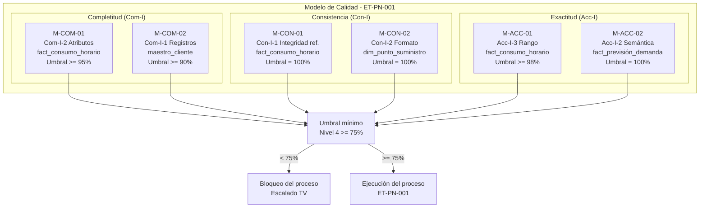

# ModeloCalidad - Modelo de Calidad del Dato

**Identificador:** ET-DQ-MC-001 | **Versión:** 1.0 | **Fecha:** 2026-05-01
**Marco de referencia:** UNE 0081 (basada en ISO/IEC 25012, 25024 y 25040)
**Proceso asociado:** ET-PN-001 - Previsión de la Demanda Energetica

---

## 1. Contexto y motivación

Los datos que alimentan el proceso de previsión de demanda energetica de EnergiTech presentan problemas conocidos: registros de clientes duplicados en tres sistemas distintos (CRM Salesforce, SAP-ISU y ERP de Mantenimiento), lecturas de consumo con valores ausentes o anómalos, y datos meteorologicos que en ocasiones llegan con retraso. Todo ello se traduce en pérdida de confianza del equipo de Operaciones en los resultados del modelo predictivo y en decisiones de distribución potencialmente erróneas.

El objetivo de este proyecto es medir el estado actual de la calidad del dato para determinar si es suficiente de acuerdo al apetito de riesgo de EnergiTech para garantizar el exito del proceso ET-PN-001. Se aplica el marco de evaluación de UNE 0081.

---

## 2. Selección de características de calidad

De las características definidas en UNE 0081 (basadas en ISO/IEC 25012), se selecciónan tres por su relevancia directa para el escenario de EnergiTech y su alineación con los requisitos definidos en el Proyecto 1:

| Característica | Codigo UNE 0081 | Justificación de selección | Req. P1 vinculado |
| :--- | :--- | :--- | :--- |
| Completitud | Com-I | Sin datos completos en las series de consumo, el modelo predictivo no puede operar. Es condición necesaria antes de ejecutar el ETL. | RC-01, RN-03 |
| Consistencia | Con-I | Los mismos clientes aparecen con IDs distintos en CRM, SAP-ISU y ERP. Sin consistencia entre sistemas, la agregación de consumos es incorrecta y el MDM no puede funciónar. | RC-03, RC-05 |
| Exactitud | Acc-I | El modelo predictivo exige un MAPE <= 10% (RN-03). Si las lecturas de consumo que lo alimentan tienen errores sistematicos, la exactitud del modelo se degrada independientemente del algoritmo utilizado. | RC-02, RN-03 |

La UNE 0081 contempla estas tres características como requisitos especificos para sistemas de IA: carecer de errores (consistencia), pertinencia (exactitud) y completitud (completitud). Esto refuerza su elección dado que el proceso ET-PN-001 esta basado en un modelo de ML.

---

## 3. Apetito de riesgo y escala de calidad

EnergiTech opera en un sector crítico donde los errores en la previsión de demanda pueden traducirse en fallos de suministro para clientes críticos (hospitales, industrias esenciales). El apetito de riesgo de la organizacion es **bajo**: se exige una calidad minima en nivel 4 (Muy Buena, >= 75 sobre 100) para poder ejecutar el proceso. Por debajo de ese umbral, el proceso se bloquea y se notifica al responsable de calidad del dato.

| Nivel | Rango | Descripción | Accion en EnergiTech |
| :--- | :--- | :--- | :--- |
| 1 | 0 - 20 | Calidad deficiente | Bloqueo inmediato del proceso |
| 2 | 20 - 50 | Calidad insuficiente | Bloqueo del proceso; escalado a Dirección |
| 3 | 50 - 75 | Calidad buena | Ejecución con aviso; revisión obligatoria del informe |
| 4 | 75 - 90 | Calidad muy buena | Ejecución normal |
| 5 | 90 - 100 | Calidad excelente | Ejecución normal |

**Umbral mínimo de EnergiTech: nivel 4 (>= 75).** Cualquier medición por debajo activa el control TV correspondiente del pipeline ETL definido en el Proyecto 2.

---

## 4. Diagrama del modelo de calidad

---

## 5. Resumen del modelo de calidad

| ID Medida | Característica | Propiedad UNE 0081 | Dataset | Umbral | Nivel min. |
| :--- | :--- | :--- | :--- | :--- | :--- |
| M-COM-01 | Completitud | Com-I-2 Completitud de atributos | `fact_consumo_horario` | >= 95% | 4 |
| M-COM-02 | Completitud | Com-I-1 Completitud de registros | `maestro_cliente` | >= 90% | 4 |
| M-CON-01 | Consistencia | Con-I-1 Integridad referencial | `fact_consumo_horario` | 100% | 5 |
| M-CON-02 | Consistencia | Con-I-2 Consistencia de formato | `dim_punto_suministro` | 100% | 5 |
| M-ACC-01 | Exactitud | Acc-I-3 Rango de exactitud | `fact_consumo_horario` | >= 98% | 4 |
| M-ACC-02 | Exactitud | Acc-I-2 Exactitud semántica | `fact_previsión_demanda` | 100% | 5 |

Las medidas M-CON-01, M-CON-02 y M-ACC-02 tienen tolerancia cero porque cualquier desviación invalida directamente el output del proceso o compromete el cumplimiento normativo (RGPD, integridad del MDM). Las medidas de completitud admiten un margen pequeño para absorber fallos puntuales de ingesta sin bloquear el proceso completo.

Ver implementación SQL de cada medida en [Medición/medidas.md](../Medición/medidas.md).