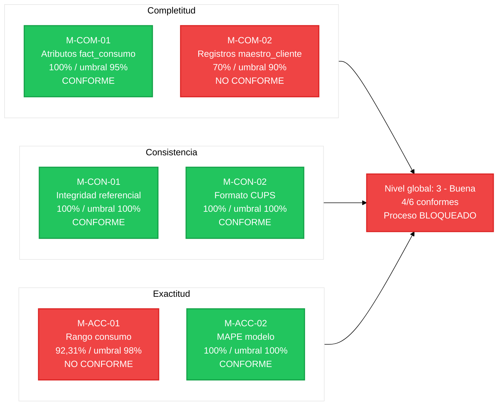
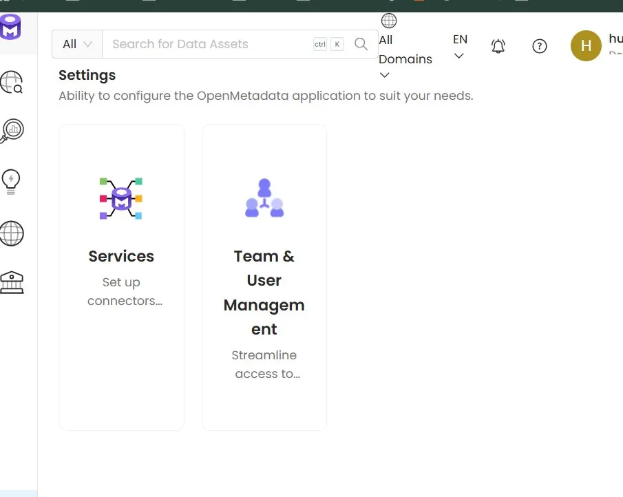
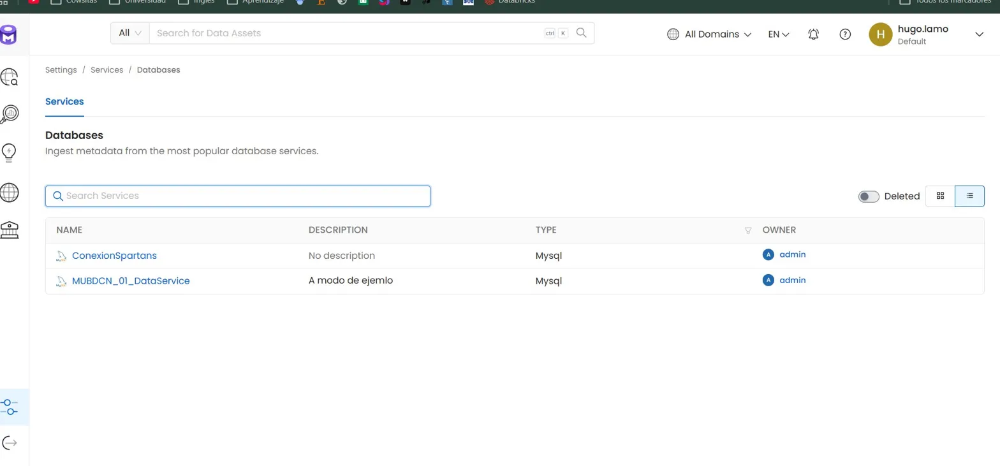

# Cuadro de Mandos de Calidad del Dato

**Identificador:** ET-CTRL-CMD-001 | **Versión:** 1.0 | **Fecha:** 2026-05-02
**Marco de referencia:** UNE 0079 - CtrlDQ.T3
**Proceso asociado:** ET-PN-001 - Previsión de la Demanda Energetica

---

## 1. Estado del ultimo ciclo de medición (mayo 2026)

El cuadro de mandos consolida los resultados de las seis medidas en una vista unica para la Dirección de Operaciones y el Data Steward. Se actualiza mensualmente tras cada ejecución de los procedimientos.

| Medida | Característica | Resultado | Umbral | Estado | Tendencia |
| :--- | :--- | :--- | :--- | :--- | :--- |
| M-COM-01 | Completitud atributos | 100% | >= 95% | Conforme | - |
| M-COM-02 | Completitud registros | 70% | >= 90% | No conforme | Acción requerida |
| M-CON-01 | Integridad referencial | 100% | 100% | Conforme | - |
| M-CON-02 | Formato CUPS | 100% | 100% | Conforme | - |
| M-ACC-01 | Rango consumo | 92,31% | >= 98% | No conforme | Acción requerida |
| M-ACC-02 | MAPE modelo | 100% | 100% | Conforme | - |

**Nivel global del ciclo:** 4 de 6 medidas conformes -> nivel 3 (Buena) segun escala UNE 0081. Por debajo del nivel mínimo exigido (nivel 4). El proceso ET-PN-001 no puede ejecutarse hasta resolver M-COM-02 y M-ACC-01.

---

## 2. Diagrama de estado de indicadores

---

## 3. Soporte en OpenMetadata

EnergiTech tiene desplegada una instancia de OpenMetadata en <http://172.20.48.127:8585> como herramienta de soporte a la gestión de metadatos y calidad del dato. Durante el proyecto se ha verificado que la instancia esta operativa y tiene configurada una conexión al servidor Spartan (ConexiónSpartans).

La BD Grupo10 esta pendiente de ingesta en OpenMetadata por restricciones de permisos en la instancia compartida del master. Una vez ingestada, los tests de calidad se configurarian sobre `maestro_cliente` y `fact_consumo_horario` siguiendo estos pasos:

1. Ir a la tabla en Explore -> Tables.
2. Pestana Data Quality -> Add Test.
3. Para M-COM-02: test `Column Values To Not Be Null` sobre `id_nacional` y `email_verificado`. Umbral >= 90%.
4. Para M-ACC-01: test `Column Values To Be Between` sobre `consumo_kwh`. Min: 0, Max: 3x media histórica. Umbral >= 98%.
5. Ejecutar los tests y revisar el panel de resultados.

Los resultados reales de calidad obtenidos desde DBeaver estan documentados en el cuadro de mandos principal (seccion 1). Las no conformidades detectadas se registran en [no_conformidades.md](no_conformidades.md).