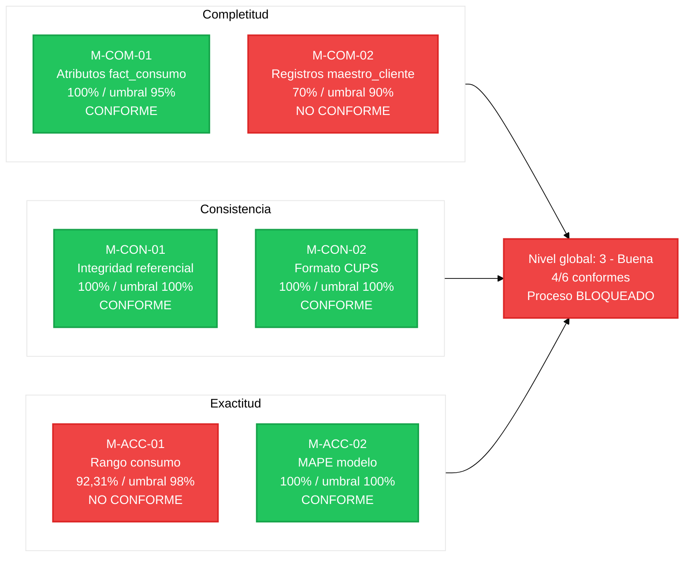

# Cuadro de Mandos de Calidad del Dato

**Identificador:** ET-CTRL-CMD-001 | **Version:** 1.0 | **Fecha:** 2026-05-02
**Marco de referencia:** UNE 0079 - CtrlDQ.T3
**Proceso asociado:** ET-PN-001 - Prevision de la Demanda Energetica

---

## 1. Estado del ultimo ciclo de medicion (mayo 2026)

El cuadro de mandos consolida los resultados de las seis medidas en una vista unica para la Direccion de Operaciones y el Data Steward. Se actualiza mensualmente tras cada ejecucion de los procedimientos.

| Medida | Caracteristica | Resultado | Umbral | Estado | Tendencia |
| :--- | :--- | :--- | :--- | :--- | :--- |
| M-COM-01 | Completitud atributos | 100% | >= 95% | Conforme | - |
| M-COM-02 | Completitud registros | 70% | >= 90% | No conforme | Accion requerida |
| M-CON-01 | Integridad referencial | 100% | 100% | Conforme | - |
| M-CON-02 | Formato CUPS | 100% | 100% | Conforme | - |
| M-ACC-01 | Rango consumo | 92,31% | >= 98% | No conforme | Accion requerida |
| M-ACC-02 | MAPE modelo | 100% | 100% | Conforme | - |

**Nivel global del ciclo:** 4 de 6 medidas conformes -> nivel 3 (Buena) segun escala UNE 0081. Por debajo del nivel minimo exigido (nivel 4). El proceso ET-PN-001 no puede ejecutarse hasta resolver M-COM-02 y M-ACC-01.

---

## 2. Diagrama de estado de indicadores

---

## 3. Herramienta de soporte: OpenMetadata

OpenMetadata permite configurar tests de calidad sobre las tablas del catalogo (CT-101, CT-201) y programar su ejecucion periodica. Los resultados se visualizan en el panel de calidad de cada dataset, que actua como cuadro de mandos nativo.

| Parametro | Valor |
| :--- | :--- |
| URL instancia Grupo10 | http://172.20.48.127:8585 |
| Assets con tests configurados | CT-101 (`maestro_cliente`), CT-201 (`fact_consumo_horario`) |
| Frecuencia de ejecucion | Mensual - primer dia habil |
| Responsable de revision | Data Steward |

Las no conformidades detectadas en este ciclo se documentan en [no_conformidades.md](no_conformidades.md).
