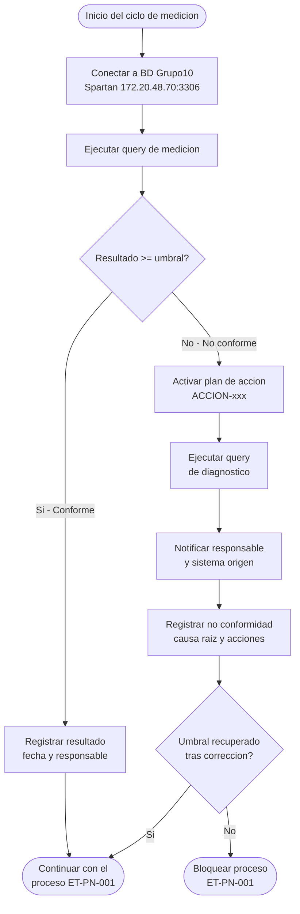

# Procedimientos de Medicion de Calidad del Dato

**Identificador:** ET-CTRL-PROC-001 | **Version:** 1.0 | **Fecha:** 2026-05-02
**Marco de referencia:** UNE 0079 - CtrlDQ.T1 / CtrlDQ.T2
**Proceso asociado:** ET-PN-001 - Prevision de la Demanda Energetica

---

## 1. Requisitos de calidad priorizados (CtrlDQ.T1)

Los requisitos proceden del catalogo del Proyecto 1 y de los resultados del Proyecto 4. Se ordenan por criticidad para el proceso ET-PN-001.

| Prioridad | Requisito | Medida P4 | Resultado | Estado |
| :--- | :--- | :--- | :--- | :--- |
| 1 - Critica | Completitud de registros en maestro_cliente | M-COM-02 | 70% | No conforme |
| 2 - Critica | Exactitud del rango de consumo | M-ACC-01 | 92,31% | No conforme |
| 3 - Alta | Completitud de atributos en fact_consumo_horario | M-COM-01 | 100% | Conforme |
| 4 - Alta | Integridad referencial consumo - cliente | M-CON-01 | 100% | Conforme |
| 5 - Alta | Consistencia de formato del CUPS | M-CON-02 | 100% | Conforme |
| 6 - Alta | Exactitud del modelo predictivo (MAPE) | M-ACC-02 | 100% | Conforme |

---

## 2. Flujo general de un procedimiento de medicion

El siguiente diagrama representa el flujo comun a todos los procedimientos definidos en este documento. Cada procedimiento especifica quien ejecuta la query, con que frecuencia y que accion correctora aplica ante una no conformidad.



---

## 3. Procedimientos de medicion (CtrlDQ.T2)

Para cada medida se define un procedimiento completo que especifica quien mide, cuando, como, con que herramienta y que se hace ante una no conformidad.

---

### PROC-COM-02 - Completitud de registros en maestro_cliente

| Campo | Detalle |
| :--- | :--- |
| Medida asociada | M-COM-02 |
| Caracteristica | Completitud (Com-I-1) |
| Dataset | `maestro_cliente` - BD Grupo10, servidor Spartan |
| Responsable | Data Steward |
| Frecuencia | Mensual - primer dia habil del mes, antes de ejecutar ET-PN-001 |
| Herramienta | OpenMetadata (test de calidad) + DBeaver para validacion manual |
| Umbral | >= 90% |

**Pasos del procedimiento:**

1. Conectar a la BD Grupo10 (Spartan 172.20.48.70:3306) con VPN activa.
2. Ejecutar la query M-COM-02 y registrar el resultado.
3. Evaluar el resultado contra el umbral: si es >= 90%, registrar en el log de monitorizacion y continuar. Si es < 90%, activar el plan de accion ACCION-COM-02.
4. Registrar resultado, fecha y responsable en la tabla de seguimiento.

**Plan de accion ante no conformidad (ACCION-COM-02):**

Identificar los registros con `id_nacional` o `email_verificado` NULL mediante la query de diagnostico. Notificar al equipo del CRM Salesforce para completar los datos en el sistema origen. Bloquear la ejecucion del proceso ET-PN-001 hasta que el umbral se recupere. Registrar la no conformidad con causa raiz, acciones tomadas y fecha de resolucion.

```sql
-- Diagnostico PROC-COM-02: registros incompletos en maestro_cliente
SELECT id_cliente_maestro, nombre_normalizado,
       id_nacional, email_verificado, estado
FROM Grupo10.maestro_cliente
WHERE id_nacional       IS NULL
   OR email_verificado  IS NULL
   OR nombre_normalizado IS NULL
   OR tipo_cliente      IS NULL;
```

---

### PROC-ACC-01 - Exactitud del rango de consumo

| Campo | Detalle |
| :--- | :--- |
| Medida asociada | M-ACC-01 |
| Caracteristica | Exactitud (Acc-I-3) |
| Dataset | `fact_consumo_horario` - BD Grupo10, servidor Spartan |
| Responsable | Analista de Demanda |
| Frecuencia | Mensual - coincidiendo con la ingesta del mes antes de la validacion ETL |
| Herramienta | OpenMetadata (test de calidad) + DBeaver para validacion manual |
| Umbral | >= 98% |

**Pasos del procedimiento:**

1. Ejecutar la query M-ACC-01 sobre los registros del mes en curso.
2. Evaluar el resultado: si es >= 98%, registrar y continuar al bloque de validacion ETL (TV-02). Si es < 98%, activar ACCION-ACC-01.
3. Registrar resultado, fecha, numero de anomalias detectadas y responsable.

**Plan de accion ante no conformidad (ACCION-ACC-01):**

Ejecutar la query de diagnostico para listar los registros anomalos. Clasificar cada anomalia: error de sensor SCADA (escalar a equipo tecnico) o error de transmision (aplicar correccion con `calidad_lectura = 'CORREGIDA'`). Si el numero de anomalias supera el 5% del lote, rechazar el lote completo (TV-01). Registrar la no conformidad con causa raiz y acciones tomadas.

```sql
-- Diagnostico PROC-ACC-01: lecturas anomalas del mes en curso
SELECT fch.id_registro, fch.cups, fch.ts_lectura,
       fch.consumo_kwh,
       media_hist.media,
       fch.consumo_kwh / media_hist.media AS ratio_vs_media
FROM Grupo10.fact_consumo_horario fch
JOIN (
    SELECT cups, AVG(consumo_kwh) AS media
    FROM Grupo10.fact_consumo_horario
    WHERE calidad_lectura = 'REAL'
    GROUP BY cups
) media_hist ON fch.cups = media_hist.cups
WHERE fch.consumo_kwh < 0
   OR fch.consumo_kwh > 3 * media_hist.media
ORDER BY fch.ts_lectura;
```

---

### PROC-COM-01 - Completitud de atributos en fact_consumo_horario

| Campo | Detalle |
| :--- | :--- |
| Medida asociada | M-COM-01 |
| Caracteristica | Completitud (Com-I-2) |
| Dataset | `fact_consumo_horario` |
| Responsable | Analista de Demanda |
| Frecuencia | Mensual - durante la fase de ingesta (Actividad 1 del BPMN) |
| Herramienta | OpenMetadata + pipeline ETL (control TV-01) |
| Umbral | >= 95% |

**Pasos del procedimiento:** ejecutar M-COM-01 al finalizar la ingesta. Si el resultado es >= 95%, continuar. Si es < 95%, rechazar el lote y notificar al responsable de calidad — aplica TV-01 del pipeline ETL del Proyecto 2.

---

### PROC-CON-01 - Integridad referencial consumo - cliente

| Campo | Detalle |
| :--- | :--- |
| Medida asociada | M-CON-01 |
| Caracteristica | Consistencia (Con-I-1) |
| Dataset | `fact_consumo_horario` - `maestro_cliente` |
| Responsable | DBA |
| Frecuencia | Mensual - tras la ejecucion del MDM y antes de la validacion ETL |
| Herramienta | Constraint FK en MySQL + OpenMetadata |
| Umbral | 100% (tolerancia cero) |

**Pasos del procedimiento:** el constraint FK de la BD actua como primera linea de defensa. Ejecutar M-CON-01 como verificacion adicional. Cualquier registro huerfano indica un fallo en el proceso MDM y bloquea el pipeline.

---

### PROC-CON-02 - Consistencia de formato del CUPS

| Campo | Detalle |
| :--- | :--- |
| Medida asociada | M-CON-02 |
| Caracteristica | Consistencia (Con-I-2) |
| Dataset | `dim_punto_suministro` |
| Responsable | DBA |
| Frecuencia | Con cada alta o modificacion de punto de suministro |
| Herramienta | Constraint CHECK en MySQL (`REGEXP '^ES[0-9]{16}[A-Z]{2}$'`) |
| Umbral | 100% (tolerancia cero) |

**Pasos del procedimiento:** el constraint CHECK de la BD bloquea la insercion de CUPS con formato incorrecto. Ejecutar M-CON-02 mensualmente como auditoria. Cualquier desviacion indica que hay registros previos al constraint que deben corregirse en el sistema origen.

---

### PROC-ACC-02 - Exactitud del modelo predictivo (MAPE)

| Campo | Detalle |
| :--- | :--- |
| Medida asociada | M-ACC-02 |
| Caracteristica | Exactitud (Acc-I-2) |
| Dataset | `fact_prevision_demanda` |
| Responsable | Analista de Demanda |
| Frecuencia | Mensual - tras la ejecucion del modelo IA (Actividad 3 del BPMN) |
| Herramienta | MLflow (registro de metricas) + OpenMetadata |
| Umbral | 100% (tolerancia cero sobre registros publicados) |

**Pasos del procedimiento:** el modelo registra el MAPE en MLflow al finalizar cada ejecucion. Si el MAPE supera el 10%, el resultado no se inserta en `fact_prevision_demanda` y se escala a revision del equipo de Analitica. M-ACC-02 verifica que todos los registros publicados cumplen el umbral.
