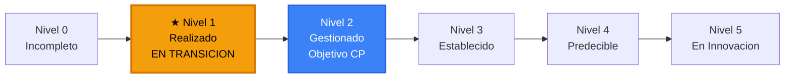

# Autoevaluación de Madurez - Modelo MAMD (UNE 0080)

**Identificador:** ET-MAD-AE-001 | **Versión:** 1.0 | **Fecha:** 2026-05-02
**Marco de referencia:** UNE 0080 - MAMD (basado en ISO/IEC 33000)
**Proceso asociado:** ET-PN-001 - Previsión de la Demanda Energética

---

## 1. Contexto

A lo largo de los seis proyectos de la práctica transversal, EnergiTech ha diseñado, implantado y ejecutado procesos de gestión del dato, metadatos, datos maestros y calidad del dato siguiendo las especificaciones UNE 0078, UNE 0087 y UNE 0079. Este documento aplica el modelo de madurez MAMD de UNE 0080 para determinar en qué nivel se encuentra la organización y qué tendría que hacer para subir al siguiente.

La evaluación es de carácter exploratorio y autoevaluativa, basada en las evidencias generadas durante la práctica transversal.

---

## 2. Modelo de referencia MAMD

UNE 0080 define cinco niveles de madurez organizacional, cada uno condicionado a que los procesos de los niveles anteriores estén completamente implementados (F - Fully Implemented):

| Nivel | Nombre | Condición |
| :--- | :--- | :--- |
| 0 | Incompleto | El proceso no está implementado o falla al ejecutarse |
| 1 | Realizado | Todos los procesos de NM1 con calificación F |
| 2 | Gestionado | Todos los de NM1 con F + los de NM2 con al menos L |
| 3 | Establecido | NM1 y NM2 con F + los de NM3 con al menos L |
| 4 | Predecible | NM1, NM2 y NM3 con F + los de NM4 con al menos L |
| 5 | En Innovación | NM1 a NM4 con F + los de NM5 con al menos L |

### Posición actual de EnergiTech en la escalera de madurez

EnergiTech se encuentra en **transición hacia el Nivel 1**. Los procesos están diseñados y parcialmente ejecutados con resultados reales medibles, pero MetDat, MDM y CtrlDQ no han alcanzado calificación F por pendientes de automatización e integración.

---

## 3. Evaluación por proceso

### 3.1 Procesos de Gestión del Dato (UNE 0078)

**ProcDat - Procesamiento del dato (Proyecto 1)**

Se modeló el proceso de negocio ET-PN-001 en BPMN con cinco actividades, datasets identificados por nombre, criterios de validación y actores definidos. Se elaboró un catálogo de requisitos (ReqDat) con 20 entradas en cuatro categorías y trazabilidad con el BPMN. Se aplicó gestión de configuración sobre los artefactos generados.

**Calificación: F** - el proceso produce sus outputs definidos de forma documentada y trazable.

---

**MetDat - Gestión de metadatos (Proyecto 2)**

Se crearon los tres repositorios de metadatos exigidos por UNE 0087: glosario de negocio (20 términos en OpenMetadata), catálogo de datos (7 activos CT-101 a CT-701) y diccionario de datos (DT-101 a DT-701). Se estableció la trazabilidad cruzada entre los tres niveles y se documentó el ciclo de vida del dato con la arquitectura medallón Bronze/Silver/Gold y seis políticas de gobierno.

**Calificación: L** - el proceso está ampliamente implementado; pendiente la aprobación de los términos del glosario en OpenMetadata (Draft -> Approved) y la ingesta del catálogo en la plataforma.

---

**MDM - Gestión de datos maestros (Proyecto 3)**

Se especificó el registro maestro de la entidad Cliente con reglas de matching (RM-01 a RM-03), matriz de autoridad por atributo y estilo arquitectónico de consolidación justificado. Se diseñó el modelo conceptual, lógico y físico, y se crearon las tablas en MySQL (BD Grupo10, servidor Spartan) mediante DDL ejecutado. Se documentó la arquitectura completa con diagrama Mermaid.

**Calificación: L** - el modelo está diseñado e implementado en base de datos; el proceso de matching real con los sistemas fuente (CRM, SAP-ISU, ERP) no está automatizado en esta fase exploratoria.

---

### 3.2 Procesos de Gestión de la Calidad del Dato (UNE 0079)

**PlanDQ - Planificación de la calidad del dato (Proyecto 4)**

Se seleccionaron tres características de calidad de UNE 0081 (Completitud, Consistencia, Exactitud) justificadas frente a los requisitos del negocio. Se definieron seis medidas (M-COM-01/02, M-CON-01/02, M-ACC-01/02) con sus propiedades medibles, fórmulas, umbrales alineados al apetito de riesgo y SQL ejecutable. Los resultados reales se obtuvieron contra datos de prueba en Spartan.

**Calificación: F** - el proceso planifica y define las medidas de calidad de forma completa y ejecutable.

---

**CtrlDQ - Control y monitorización de la calidad del dato (Proyecto 5)**

Se definieron seis procedimientos de medición (PROC-COM/CON/ACC) con responsable, frecuencia, herramienta, umbral y plan de acción ante no conformidad. Se identificaron dos no conformidades reales (NC-001 y NC-002) con causa raíz y acciones correctoras. Se elaboró un cuadro de mandos con el estado de las seis medidas y se documentó el soporte en OpenMetadata.

**Calificación: L** - los procedimientos están definidos y se han ejecutado manualmente; la automatización en OpenMetadata está pendiente de la ingesta de Grupo10.

---

## 4. Tabla resumen y nivel derivado

| Proceso | Proyecto | Marco | Calificación | NM requerido | Cumple |
| :--- | :--- | :--- | :--- | :--- | :--- |
| ProcDat | P1 | UNE 0078 | F - Completamente implementado | NM1 | Sí |
| MetDat | P2 | UNE 0087 | L - Ampliamente implementado | NM1 | Parcial |
| MDM | P3 | UNE 0078 | L - Ampliamente implementado | NM1 | Parcial |
| PlanDQ | P4 | UNE 0079 | F - Completamente implementado | NM1 | Sí |
| CtrlDQ | P5 | UNE 0079 | L - Ampliamente implementado | NM1 | Parcial |

**Nivel de madurez de EnergiTech: en transición hacia Nivel 1 - Realizado.**

Para alcanzar el Nivel 1, todos los procesos de NM1 deben tener calificación F. ProcDat y PlanDQ lo cumplen, pero MetDat, MDM y CtrlDQ están en L. Los elementos que impiden calificar con F son: la automatización de los procedimientos de calidad, la aprobación formal del glosario en OpenMetadata y la integración real del MDM con los sistemas fuente.

Ver el plan de acciones en [PlanMejora/plan_mejora.md](../PlanMejora/plan_mejora.md).
